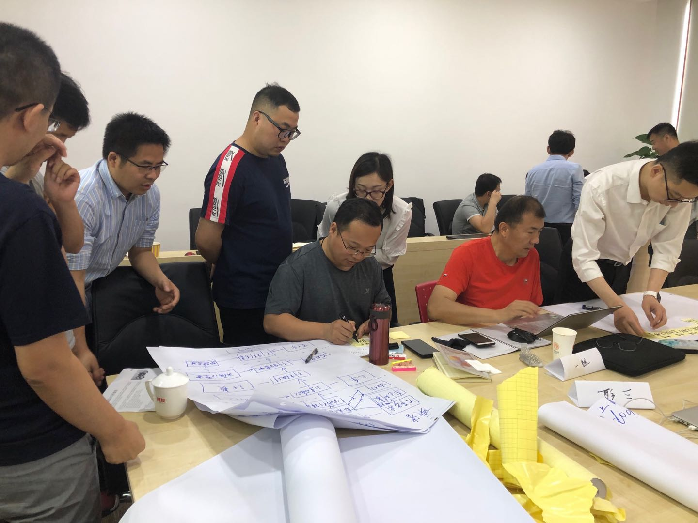
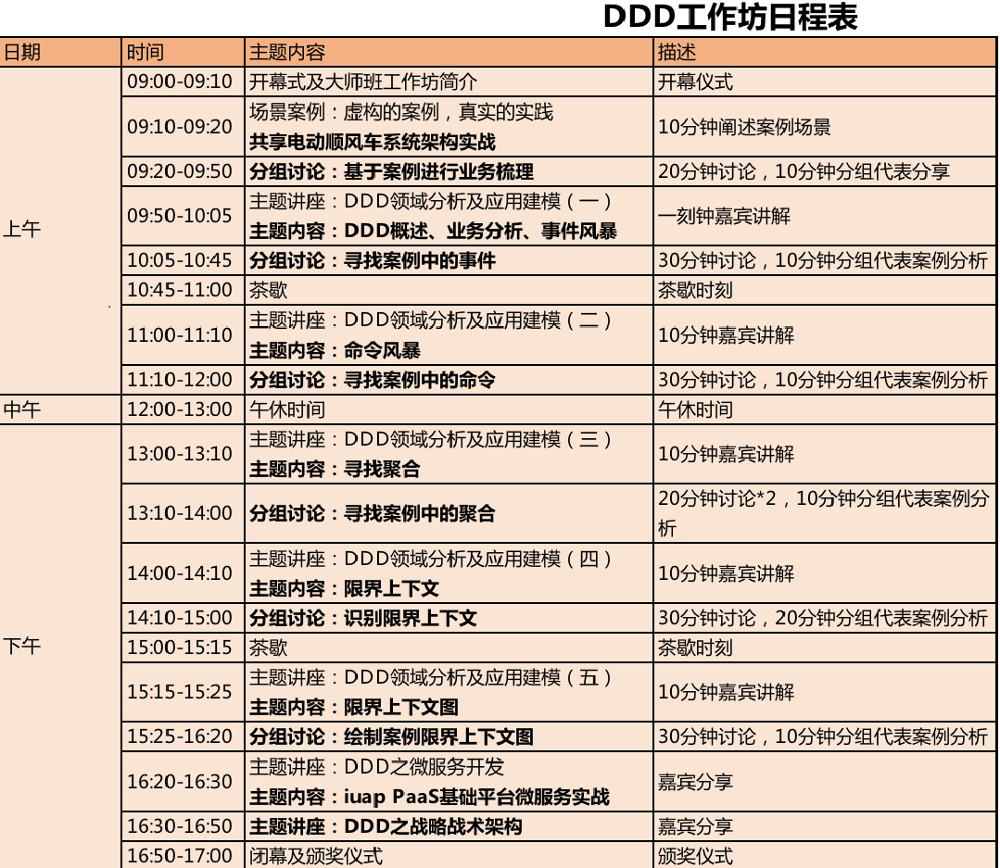
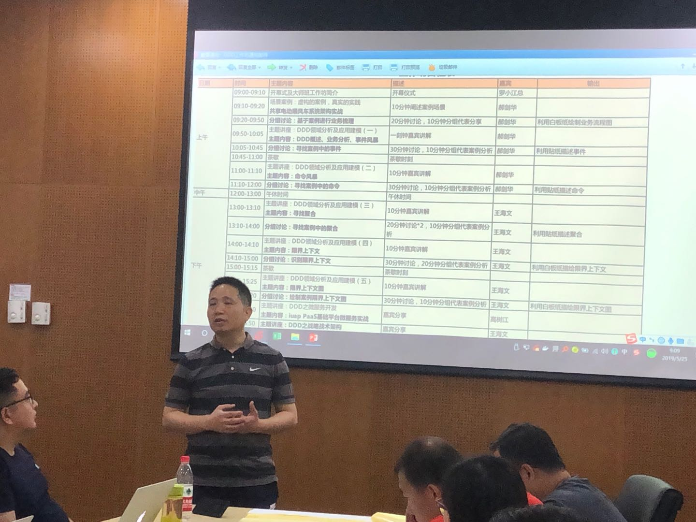
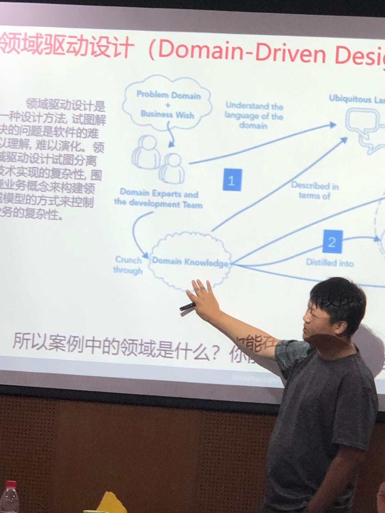
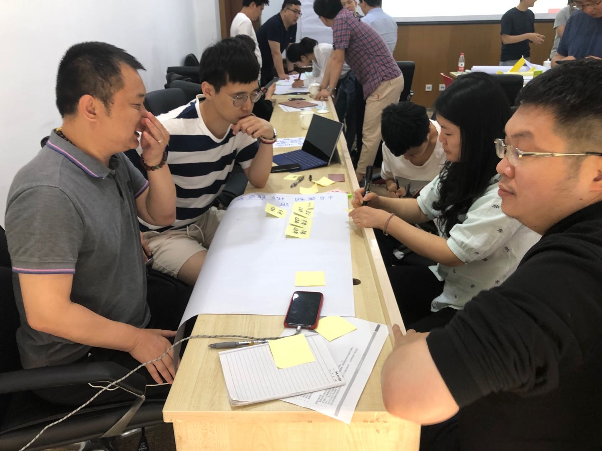
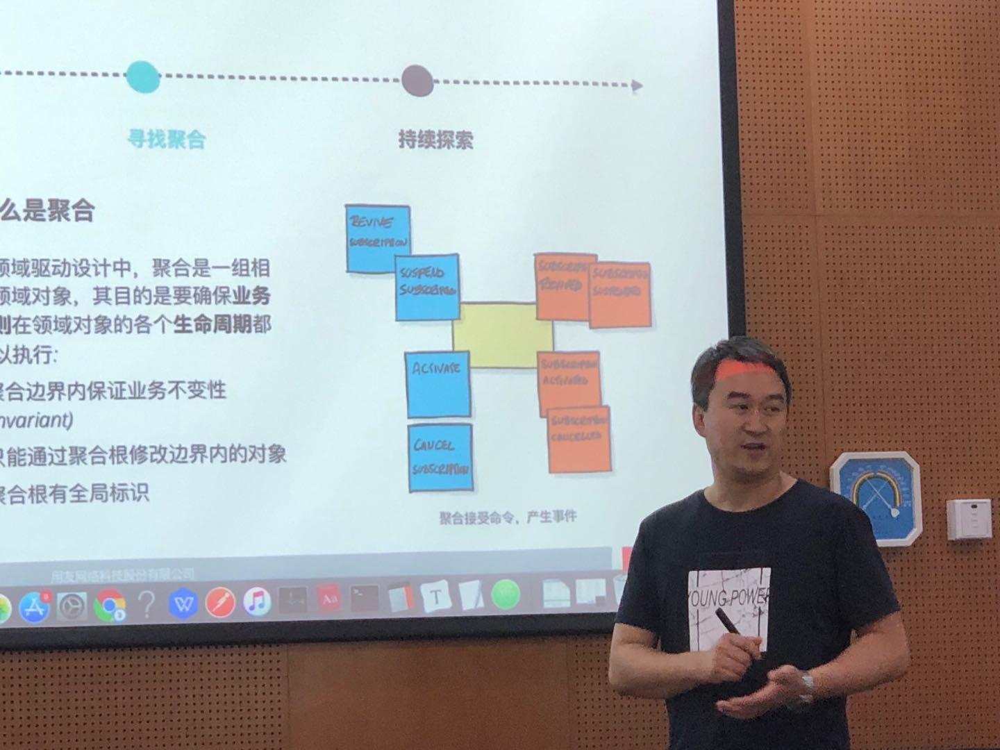
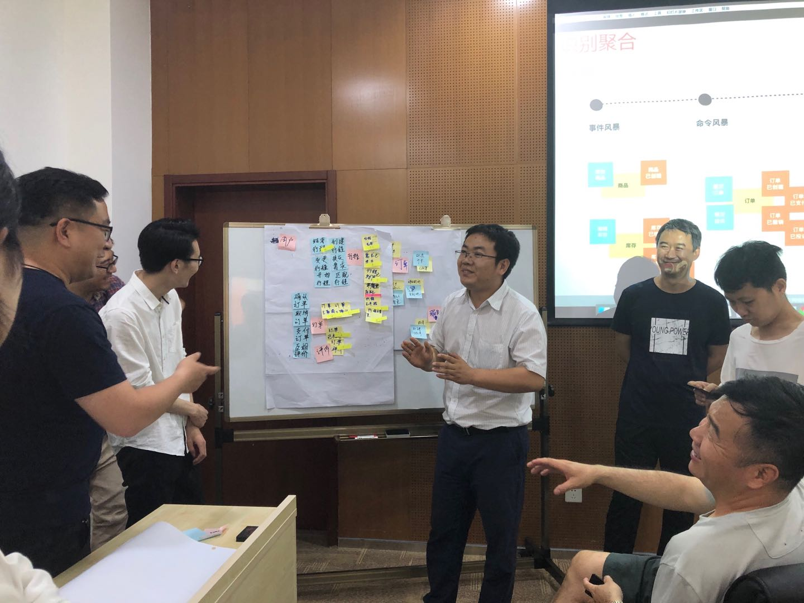
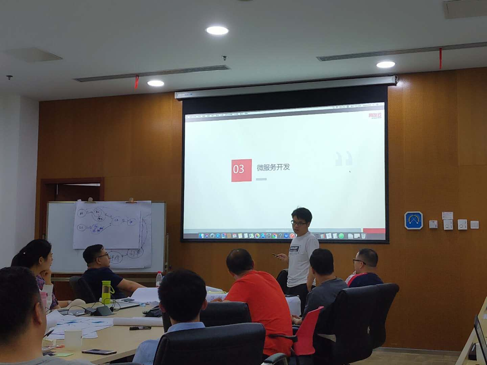
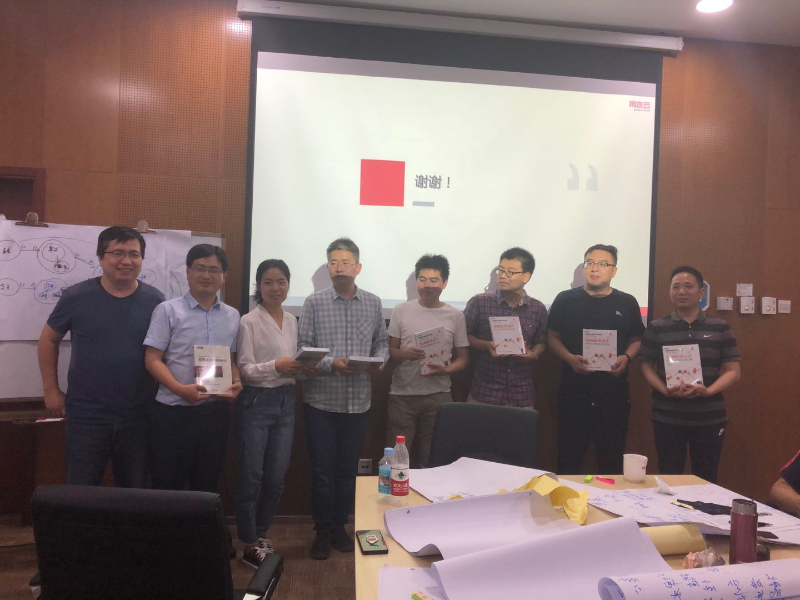

# 用友首次开设高端课程·领域驱动设计（DDD）｜让我们更好地面向对象

用友公司首次在高端课程里增加了领域驱动设计--DDD课程，并在5月25日正式开课。本次课程专门为企业管理者和资深IT人员设立，旨在将用友多年积累的实战技术与经验分享给学员，提升学员实战能力。此次开设的领域驱动设计（DDD）高端课程，设计了大量的案例实操环节和建模环节，并且邀请了几位领域专家前来授课，目标是让学员掌握领域驱动设计每一层的职责以及功能、DD中的核心战术概念及工具，比如：领域服务，领域事件，资源库，聚合，实体，值对象、以及对于以上这些概念，在代码层面的设计与实现。

 

图1 领域驱动设计培训现场

本次课程培训表：

 
5月25日上午9:00，首次云平台领域驱动设计工作坊在E117会议室举办，来自云平台、金融、能源、建筑的30多名学员分成四组参加了活动，云平台领导在开场致辞。

 

图2 云平台领导讲话

接下来专属云架构师简单概述了DDD概念，通过领域分析及应用建模，虚构实战案例“共享电动顺风车系统架构实战”场景，学员分组讨论，对案例进行了业务梳理，寻找案例中的事件。并且深入讲解和实战了DDD中的核心方法之一命令风暴，寻找案例中的命令。

 

图3 专属云架构师讲师授课

 

图4 学员分组讨论

2月25日下午1点，由另一位专属云架构师进行DDD领域分析及应用建模，包括DDD的核心方法之聚合、限界上下文。通过分组讨论，寻找案例中的聚合、识别限界上下文、绘制案例限界上下文图。

 

图5 专属云架构师讲师授课

 

图6 学员分组讨论案例

5月25日下午4:20，技术运营部讲师开始进行嘉宾分享，主要讲解了DDD之微服务开发，和学员共同进行了iuap PaaS基础平台微服务实战演练。之后由专属云架构师讲授了“DDD之战略战术架构”的主题讲座。

 

图7 技术运营部讲师授课

经过一天的培训，学员们收获都很大，在上课过程中，同学们都积极参与，表现优秀。在本次课程闭幕时，还进行了颁奖仪式，最后由第三组取得优胜并获赠书。

 

图8 获奖小组

本次课程内容的每一个知识点都结合项目实践案例来讲解，力求内容的深入浅出，并将在讲解过程中介绍诸多架构设计原则与模式，丰富知识内涵。当天参会学员的搭配也经过认真设计——业务人员、技术人员、本部顾问、机构顾问，不同角色背景之间，真正碰撞出了火花。到场同学踊跃交流，积极呈现，气氛热烈又不失团结。本场讲师郝剑华课后表示：通过工作坊的交流学习，学员初步掌握了DDD建模工具和方法，具备了一定的微服务拆分能力，在面对客户时能够进行有效的分析和沟通，达到了预期的培训效果和目标。
